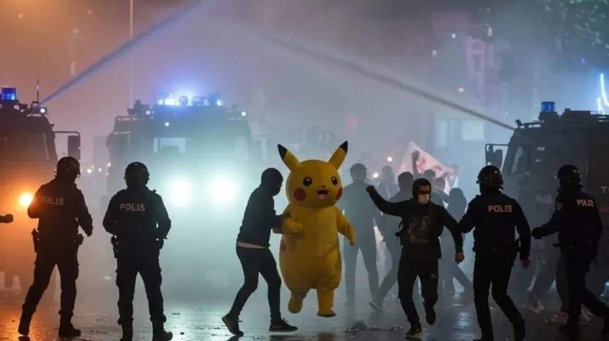

# Soutenez la démocratie en Turquie en boycottant

## Que s'est-il passé en Turquie le 25 mars ?

{: width=300 style="float:right; padding:10px"} 

- Ekrem Imamoglu, considéré comme le principal rival politique du président Recep Tayyip Erdogan et maire d'Istanbul, métropole de 16 millions d'habitants, a été arrêté pour corruption et appartenance à une organisation terroriste, après que son diplôme a été remis en question. 
- Plus de 2 000 citoyens turcs, pour la plupart de jeunes étudiants, ont été arrêtés. 
- Certains étudiants et opposants ont été arrêtés lors de descentes nocturnes à leur domicile et on compte plus de 300 détenus au total. 
- En réponse à ces événements, un mouvement de boycott a été lancé pour soutenir le mouvement de rue. 
- Ce mouvement vise principalement les entreprises connues pour leurs liens étroits avec le gouvernement et donc avec Erdogan.

Vous pouvez soutenir ce mouvement en vous informant sur les entreprises listées ci-dessous et en les boycottant. 

[Manifestations en Turquie le 20 mars 2025, Wikipedia](https://en.wikipedia.org/wiki/2025_Turkish_protests)

## Quelles entreprises faut-il boycotter ?

### Alimentation et restauration

#### EspressoLab

| Pays | Province/Ville |
| - | - |
| 🇩🇪 | Nuremberg |
| 🇽🇰 | Kosovo |
| 🇪🇬 | Le Caire |

[Notes de la communauté EspressoLab](https://boykot.web.tr/detail.php?id=65&type=marka&tab=info)

#### MADO

- [Notes de la communauté Mado](https://boykot.web.tr/detail.php?id=74&type=marka&tab=info)

| Pays | Province/Ville |
| - | - |
| 🇦🇪 | Dubaï |
| 🇪🇬 | Le Caire |
| 🇸🇦 | La Mecque |
| 🇨🇳 | Guangzhou |
| 🇦🇿 | Bakou |
| 🇳🇱 | Rotterdam |
| 🇳🇱 | La Haye |
| 🇮🇶 | Erbil |
| 🇨🇦 | Toronto |
| 🇩🇪 | Berlin |

#### Nusr-Et

| Pays | Province/Ville |
| - | - |
| 🇺🇲 | Miami |
| 🇺🇲 | New York Midtown |
| 🇺🇲 | Beverly Hills |
| 🇬🇧 | Londres |
| 🇬🇷 | Mykonos |
| 🇦🇪 | Dubaï |
| 🇦🇪 | Abou Dabi |
| 🇶🇦 | Doha |
| 🇹🇷 | Istanbul |
| 🇹🇷 | Bodrum |
| 🇹🇷 | Marmaris |

#### Ulker

- [Notes de la communauté Ülker / McVities / Godiva](https://boykot.web.tr/detail?id=67&type=marka)

### Santé et services médicaux

#### Medipol Global

| Pays | Province/Ville |
| - | - |
| 🇹🇷 | Istanbul |

- [Notes de la communauté Medipol Hastaneleri](https://boykot.web.tr/detail?id=31345&type=marka)

#### Hôpital Dunyagoz

| Pays | Province/Ville |
| - | - |
| 🇹🇷 | Istanbul |
| 🇽🇰 | Pristina |
| 🇩🇪 | Cologne |
| 🇩🇪 | Francfort |
| 🇬🇪 | Tbilissi |
| 🇦🇿 | Bakou |
| 🇧🇬 | Haskovo |
| 🇺🇿 | Tachkent |

- [Notes de la communauté de l'hôpital Dunyagoz](https://boykot.web.tr/detail.php?id=31575&type=marka&tab=notes)

### Hôtellerie et tourisme

#### Kemer Country Hotel

| Pays | Province/Ville |
| - | - |
| 🇹🇷 | Antalya |

[Notes de la communauté Kemer Country Hotel (par Demirören)](https://boykot.web.tr/detail?id=31149&type=marka)

#### Caja Maxx Royal

| Pays | Province/Ville |
| - | - |
| 🇹🇷 | Belek |
| 🇹🇷 | Kemer |
| 🇹🇷 | Bodrum |

- [Notes de la communauté Caja Maxx Royal](https://boykot.web.tr/detail?id=31920&type=marka)

#### ETSTur

- [Notes de la communauté ETSTur](https://boykot.web.tr/detail?id=31214&type=marka)